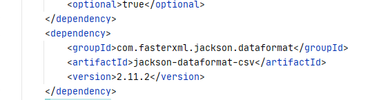
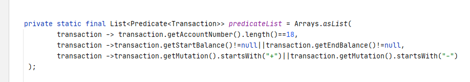
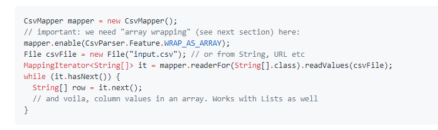

## Transaction-duplicate-identifier-assignment
Application reads the CSV or XML file whichever is placed in the following path "src/main/resources/test" and takes out the transaction list from the file. Segregate the valid and invalid transaction from the transaction and prints it in the log file.  
### Current version of the application
0.0.1-SNAPSHOT
### Technologies used
spring-boot
### External Dependencies used
* To read a CSV file 

#### Maven Dependency

* To read a xml file

#### Java version used for development
1.8

### Configurable Validations

written validations of a transaction in a predicate. If any new validation need to be added can be added since it is easily configurable.

Limitaions
> path for log4j is mentioned in c: drive

### CSV reader can be written in the following format too.

We can have our custom validation while iterating through the field itself.

